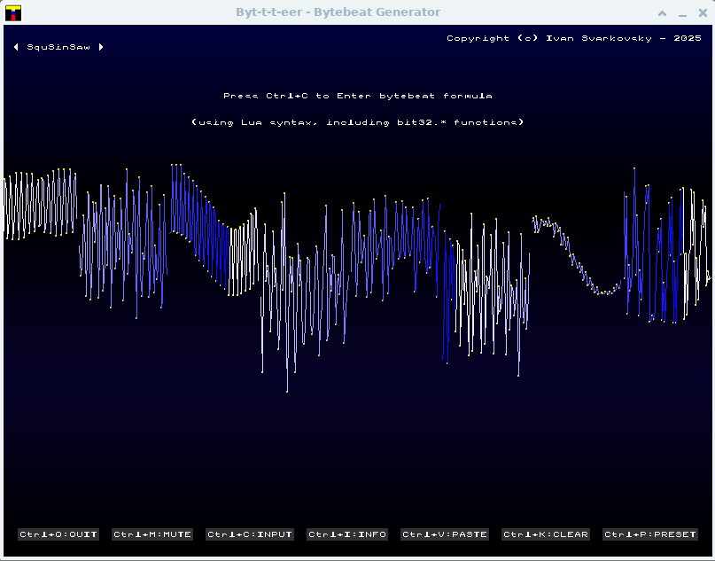

```markdown
# Byt-t-t-eer - Bytebeat Generator

A simple bytebeat music visualizer and generator with Lua formula input.

 

## Features

*   **Bytebeat Sound Generation:** Generates bytebeat audio using both a built-in formula and custom formulas.
*   **Lua Formula Input:** Allows users to define their own bytebeat formulas using Lua syntax, including bitwise operations from a built-in `bit32` library.
*   **Real-time Waveform Visualization:** Displays a dynamic waveform visualization of the generated audio.
*   **Preset Formulas:** Includes a selection of preset bytebeat formulas for quick experimentation.
*   **Interactive Input:**  Provides a text input box for editing bytebeat formulas with cursor navigation, backspace, clipboard paste, and clear functionality.
*   **Information and License Windows:** Displays windows with program information, Lua syntax help, controls, and the MIT License.
*   **Mute Animation:** Features a visual "MUTE" animation when audio is paused.
*   **Hotkeys Control:**  Offers convenient keyboard shortcuts for all essential functions.
*   **Minimalist User Interface:**  Presents a clean and functional user interface.

## Compilation

To compile the program, you will need:

*   **SDL2 Library:**  Install SDL2 development libraries on your system.
*   **Lua Library:** Install Lua 5.4 development libraries (or Lua 5.x compatible with bit32 library).
*   **A C Compiler:**  GCC or Clang are recommended.

Use the following command to compile (assuming SDL2 and Lua libraries are in your library path):

```bash
gcc -std=c99 -o bytebeat bytebeat.c sdlgfx.c sdlfont.c sdlpaudio.c -I. -L. -llua -lSDL2 -lm -O3 -march=native -mtune=native
```

**For optimized build (optional):**

```bash
gcc -std=c99 -o bytebeat bytebeat.c sdlgfx.c sdlfont.c sdlpaudio.c -I. -L. -llua -lSDL2 -lm -O3 -march=native -mtune=native \
-msse3 -mssse3 -fno-exceptions -fomit-frame-pointer -flto -fvisibility=hidden -mfpmath=sse -ffast-math -pipe \
-s -ffunction-sections -fdata-sections -Wl,--gc-sections -fno-asynchronous-unwind-tables -Wl,--strip-all -DNDEBUG
```

## Usage

**Controls:**

*   **Ctrl+Q:** Quit the application.
*   **Ctrl+M:** Mute/Unmute audio.
*   **Ctrl+C:** Enter/Edit bytebeat formula in input box.
*   **Ctrl+I:** Show/Hide Information window.
*   **Ctrl+L:** View License window.
*   **Ctrl+V:** Paste from clipboard (when input box is active).
*   **Ctrl+K:** Clear input text (when input box is active).
*   **Ctrl+P:** Load the next preset bytebeat formula.
*   **Enter:** Apply the formula entered in the input box.
*   **Left/Right Arrow Keys:** Move cursor within the input box.
*   **Up/Down Arrow Keys:** Move cursor up/down lines in the input box.
*   **Mouse Wheel:** Scroll vertically in the input box.

**Entering Custom Formulas:**

1.  Press **Ctrl+C** to activate the input box.
2.  Type your bytebeat formula using Lua syntax.
3.  Press **Enter** to apply the formula and start generating sound.

**Lua Syntax Notes:**

*   Use `t` as the time variable in your formulas.
*   The built-in `bit32` library provides bitwise operations:
    *   `bit32.band(a, b, ...)` (bitwise AND)
    *   `bit32.bor(a, b, ...)`  (bitwise OR)
    *   `bit32.bxor(a, b, ...)` (bitwise XOR)
    *   `bit32.bnot(a)`        (bitwise NOT)
    *   `bit32.lshift(a, n)`   (left shift)
    *   `bit32.rshift(a, n)`   (right shift)
    *   `bit32.arshift(a, n)`  (arithmetic right shift)
    *   `bit32.btest(a, b, ...)` (bitwise test)
    *   `bit32.extract(n, field, width)` (extract bit field)
    *   `bit32.replace(n, v, field, width)` (replace bit field)
    *   `bit32.lrotate(n, shift)` (left rotation)
    *   `bit32.rrotate(n, shift)` (right rotation)
    *   `bit32.badd(a, b)`       (bitwise addition, wraps around 2^32)
    *   `bit32.bsub(a, b)`       (bitwise subtraction, wraps around 2^32)
    *   `bit32.bmul(a, b)`       (bitwise multiplication, wraps around 2^32)
    *   `bit32.bdiv(a, b)`       (bitwise division, wraps around 2^32)
*   The result of your formula must be a number, which will be clamped to the range 0-255 and then normalized to the audio output range of -1.0 to 1.0.
*   Examples:
    *   `bit32.bmul(t, 5)`  (equivalent to `t * 5`)
    *   `bit32.bor(t, bit32.lshift(t, 2))` (equivalent to `t | (t << 2)`)

## License

This software is released under the MIT License. See the `LICENSE` file (or the License window in the application - Ctrl+L) for the full license text.

**MIT License (Simplified):**

Permission is hereby granted, free of charge, to any person obtaining a copy
of this software and associated documentation files (the "Software"), to deal
in the Software without restriction, including without limitation the rights
to use, copy, modify, merge, publish, distribute, sublicense, and/or sell
copies of the Software, and to permit persons to whom the Software is
furnished to do so, subject to the following conditions:

The above copyright notice and this permission notice shall be included in all
copies or substantial portions of the Software.

THE SOFTWARE IS PROVIDED "AS IS", WITHOUT WARRANTY OF ANY KIND, EXPRESS OR
IMPLIED, INCLUDING BUT NOT LIMITED TO THE WARRANTIES OF MERCHANTABILITY,
FITNESS FOR A PARTICULAR PURPOSE AND NONINFRINGEMENT. IN NO EVENT SHALL THE
AUTHORS OR COPYRIGHT HOLDERS BE LIABLE FOR ANY CLAIM, DAMAGES OR OTHER
LIABILITY, WHETHER IN AN ACTION OF CONTRACT, TORT OR OTHERWISE, ARISING FROM,
OUT OF OR IN CONNECTION WITH THE SOFTWARE.

## Copyright

Copyright (c) Ivan Svarkovsky - 2025
```
